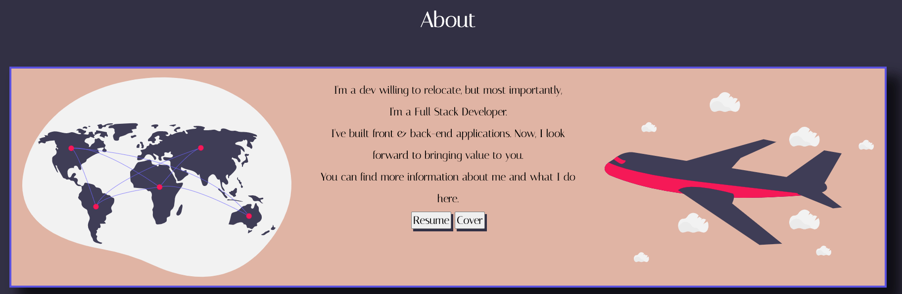
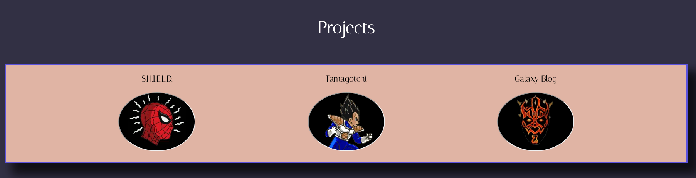
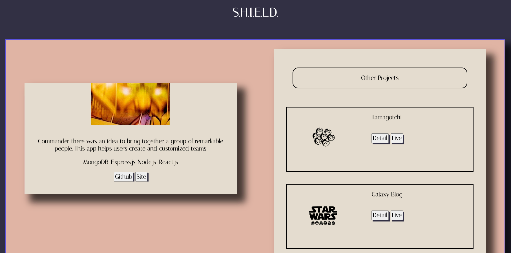

# My Personal Portfolio

### Description

Thank you for visiting my portfolio. My name is Michael and I'm a Full Stack Developer.
Here you view my most recent projects, resume, and cover letter. If you have any questions please fill out the form to contact me. Enjoy viewing my website.

### Stack

This project was made using\


## Front-End 
* Use Local Storage to set order for projects
* Pure CSS rules 
* Semantic HTML


## Code Snippet

### JavaScript 

```js
var obj = localStorage.getItem("project");
obj = JSON.parse(obj);

const { title, description, stack, github, site, gif, svg } = obj;

document.querySelector('#project').textContent = title;
document.querySelector('#desc').textContent = description;
document.querySelector('iframe').src = gif;
document.querySelector('#git').href = github;
document.querySelector('#site').href = site;

const ul = document.querySelector('#tech');
for (let i = 0; i < stack.length; i++) {
    const list = document.createElement('li');
    list.innerHTML = stack[i];
    ul.append(list)
}
```

### CSS

```cs
.project:hover > .overlay {
    background-color: #000;
    opacity: 0.3;
    transition: all 1s;
    border-radius: 50%;
    cursor: pointer;
}
```
## Live Photos




### Site Map
* [Home](https://shield-commander.netlify.app)
